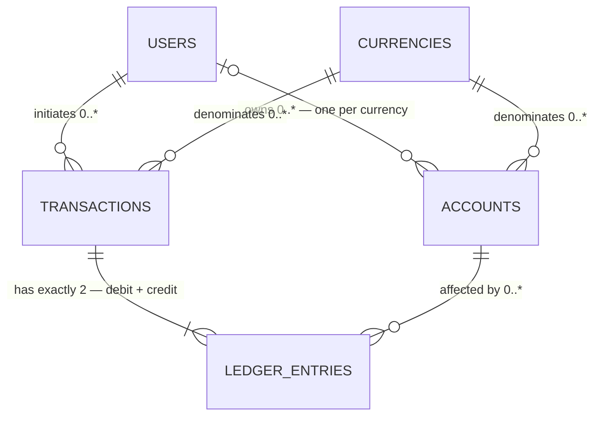
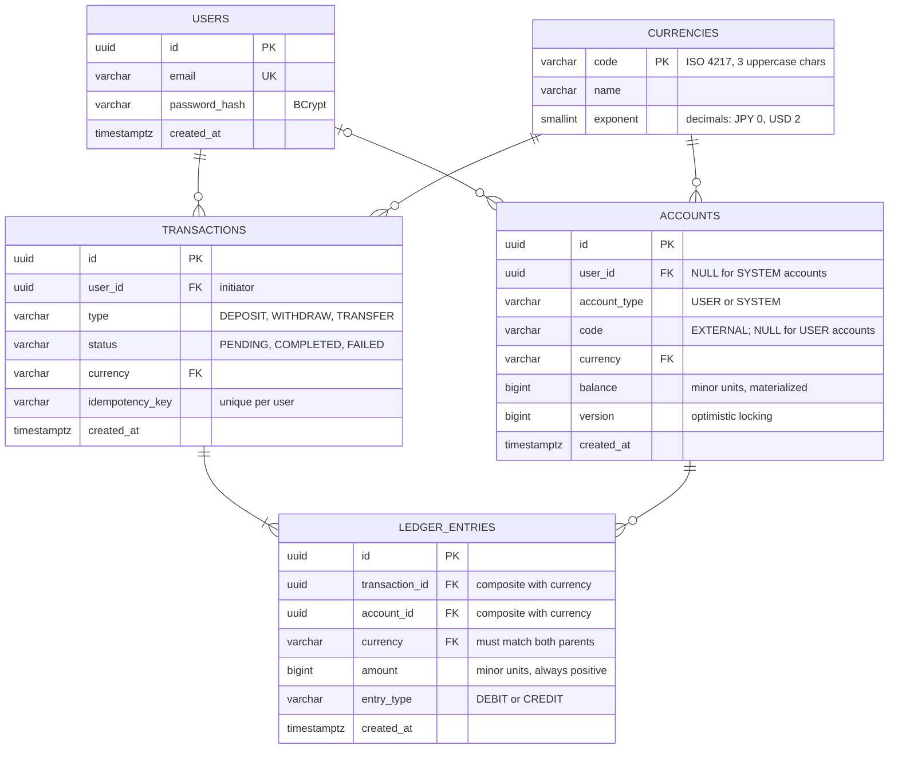

# Database Schema

Generated from the Flyway migrations in `src/main/resources/db/migration`.
Update this file in the same commit as any migration that changes it.

## Overview



### How to read the lines

Multiplicity is drawn into the line *ends* (crow's foot notation), not written as numbers.
The symbol nearest an entity says how many of **that** entity take part:

| symbol | drawn as | means |
|---|---|---|
| `\|\|` | two ticks | exactly one |
| `\|o` | tick + circle | zero or one |
| `}o` | crow's foot + circle | zero or more |
| `}\|` | crow's foot + tick | one or more |

A three-pronged "foot" means *many*; a circle means *zero is allowed*.

So `USERS |o--o{ ACCOUNTS` reads: an account has **zero or one** user (zero for `SYSTEM`
accounts), and a user has **zero or more** accounts.

Attribute markers: **PK** primary key, **FK** foreign key, **UK** unique key.

## Detail



## What the diagram can't show

### Exactly two entries

`TRANSACTIONS ||--|{ LEDGER_ENTRIES` renders as "one or more" because that is the strongest
rule crow's foot notation can express. The real rule today is **exactly two**: one debit and
one credit of equal amount. It is drawn many-valued to leave room for multi-leg transactions
(fee splits) later, and enforced by invariant 4 below.

### Composite foreign keys

`ledger_entries` does not reference its parents by id alone. Both keys include `currency`:

```sql
FOREIGN KEY (transaction_id, currency) REFERENCES transactions (id, currency)
FOREIGN KEY (account_id, currency)     REFERENCES accounts (id, currency)
```

Together these force *entry currency = transaction currency = account currency*, which makes
a cross-currency transfer structurally impossible — no trigger or application check involved.
They also make an account's currency **immutable once it has entries**, since an update would
orphan the child rows.

The `UNIQUE (id, currency)` constraints on `accounts` and `transactions` exist only to give
these foreign keys something to target; they are redundant on their own.

### The EXTERNAL account

Double-entry requires every transaction to have two sides, but a deposit's counterparty is
outside the system. `EXTERNAL` is a `SYSTEM` account standing in for the outside world:

| operation | debit | credit |
|---|---|---|
| Deposit ¥1000 | `EXTERNAL` (JPY) | user account |
| Withdraw ¥300 | user account | `EXTERNAL` (JPY) |
| Transfer ¥500 | sender | receiver — `EXTERNAL` uncounted |

Its balance is the mirror of all user funds in that currency, so it goes negative by design —
hence `CHECK (account_type = 'SYSTEM' OR balance >= 0)`.

**One `EXTERNAL` account per currency.** It is an ordinary account, so it holds exactly one
currency like any other. Enabling a currency therefore takes two inserts, in the same
migration: the `currencies` row, and its `EXTERNAL` account.

## Invariants

Queries that must hold at all times — useful as integration test assertions.

```sql
-- 1. Every currency's ledger nets to zero.
SELECT currency, SUM(CASE WHEN entry_type = 'CREDIT' THEN amount ELSE -amount END) AS net
FROM ledger_entries
GROUP BY currency
HAVING SUM(CASE WHEN entry_type = 'CREDIT' THEN amount ELSE -amount END) <> 0;

-- 2. No materialized balance has drifted from the ledger.
SELECT a.id, a.balance, COALESCE(SUM(CASE WHEN le.entry_type = 'CREDIT'
                                          THEN le.amount ELSE -le.amount END), 0) AS derived
FROM accounts a
LEFT JOIN ledger_entries le ON le.account_id = a.id
GROUP BY a.id, a.balance
HAVING a.balance <> COALESCE(SUM(CASE WHEN le.entry_type = 'CREDIT'
                                      THEN le.amount ELSE -le.amount END), 0);

-- 3. Every enabled currency has an EXTERNAL account.
SELECT c.code
FROM currencies c
LEFT JOIN accounts a ON a.code = 'EXTERNAL' AND a.currency = c.code
WHERE a.id IS NULL;

-- 4. Every transaction has exactly two entries.
SELECT transaction_id, COUNT(*)
FROM ledger_entries
GROUP BY transaction_id
HAVING COUNT(*) <> 2;
```

All four must return **zero rows**.

> Invariant 2 assumes every account's `balance` is materialized. If `EXTERNAL` balances are
> left derived instead (to avoid every deposit contending on one row), scope the query to
> `WHERE a.account_type = 'USER'`.
